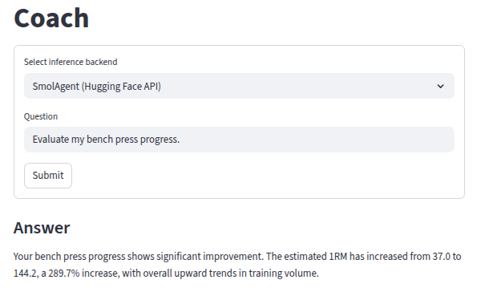
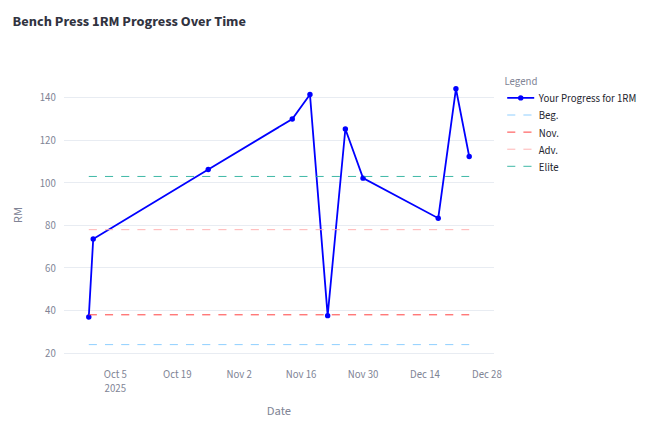
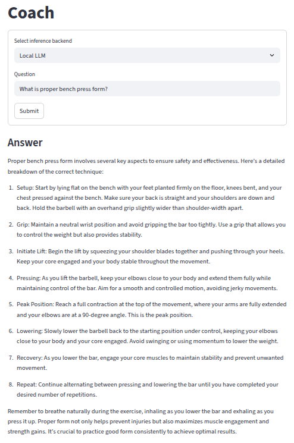

# AI-Powered Fitness Tracker & Coach

An end-to-end **fitness analytics and AI coaching platform** that combines SQL data engineering, interactive dashboards, and agentic LLMs with Retrieval-Augmented Generation (RAG) to deliver personalized, data-driven training insights.

This project demonstrates how to build a **production-style applied AI system** integrating databases, analytics, and LLM agents.

---

## Overview

The application allows users to:

- Log **strength training, cardio sessions, and body measurements**.
- Visualize progress over time with interactive dashboards.
- Ask an **AI Coach** questions about technique, progress, recovery, and nutrition.
- Receive answers grounded in:
  - Their personal data (via tools),
  - Strength standards,
  - Coaching and diet rules (via RAG).

Two inference backends are supported:
- Local HuggingFace LLM.
- SmolAgents API with tool calling.

---

## Demo

### AI Coach Interface


### Bench Press 1RM Progress


### Local LLM Answer Example


---

## Key Features

- Fitness analytics: volume, estimated 1RM, intensity, cardio metrics.
- SQL backend with repository pattern.
- Multi-page Streamlit UI with Plotly dashboards.
- AI Coach with:
  - Tool access to live user data,
  - RAG over standards and rules,
  - Natural language explanations.
- Modular architecture separating UI, core logic, persistence, and AI.
- Synthetic data generator for testing.

---

## Tech Stack

Python, Streamlit, SQLite, SQLAlchemy, Pandas, NumPy, Plotly,  
HuggingFace Transformers, SentenceTransformers, FAISS, SmolAgents.

---

## What This Project Shows

- Applied LLM systems with tool calling and RAG.
- End-to-end data pipeline from ingestion to analytics to AI reasoning.
- Clean, production-style Python architecture.
- Full-stack ML/AI engineering beyond notebooks.

This is built as a **portfolio-grade applied AI project**.

---

## Running Locally

```bash
pip install -r requirements.txt
streamlit run Home.py
```

